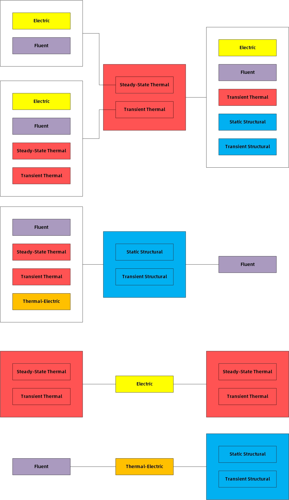

# <mark>Ansys：有限元仿真</mark>

---

# 官网

[Ansys](https://www.ansys.com/)

# 常用分析系统模块

## Steady-State Thermal（稳态热）

> Thermal **Physics**（热**物理场**）
> Mechanical APDL **Solver Type**（APDL**求解器**）
> Steady-State **Analysis Type**（稳态**分析类型**）

## Transient Thermal（瞬态热）

> Thermal **Physics**（热**物理场**）
> Mechanical APDL **Solver Type**（APDL**求解器**）
> Transient **Analysis Type**（瞬态**分析类型**）

## Static Structural（静态结构）

> Structural **Physics**（结构**物理场**）
> Mechanical APDL **Solver Type**（APDL**求解器**）
> Static Structural **Analysis Type**（静态结构**分析类型**）

## Transient Structural（瞬态结构）

> Structural **Physics**（结构**物理场**）
> Mechanical APDL **Solver Type**（APDL**求解器**）
> Transient **Analysis Type**（瞬态**分析类型**）

## Electric（电气）

> Electric **Physics**（电气**物理场**）
> Mechanical APDL **Solver Type**（APDL**求解器**）
> Steady-State Electric Conduction **Analysis Type**（稳态导电**分析类型**）

## Thermal-Electric（热-电气）

> Thermal-Electric **Physics**（热-电气**物理场**）
> Mechanical APDL **Solver Type**（APDL**求解器**）
> Steady-State Thermal-Electric Conduction **Analysis Type**（稳态热电传导**分析类型**）

## Fluid Flow (Fluent)（流体流动 (Fluent)）

> Fluids **Physics**（流体**物理场**）
> FLUENT **Solver Type**（FLUENT**求解器**）
> Any **Analysis Type**（任意**分析类型**）

# 常用组件系统模块

## Fluent

> Fluids **Physics**（流体**物理场**）
> FLUENT **Solver Type**（FLUENT**求解器**）
> Any **Analysis Type**（任意**分析类型**）

## Mechanical APDL

> Any **Physics**（任意**物理场**）
> Any **Solver Type**（任意**求解器**）
> Any **Analysis Type**（任意**分析类型**）

## Microsoft Office Excel

> Any **Physics**（任意**物理场**）
> Any **Solver Type**（任意**求解器**）
> Any **Analysis Type**（任意**分析类型**）

## Engineering Data（工程数据）

> Any **Physics**（任意**物理场**）
> Any **Solver Type**（任意**求解器**）
> Any **Analysis Type**（任意**分析类型**）

## External Data（外部数据）

> Any **Physics**（任意**物理场**）
> Any **Solver Type**（任意**求解器**）
> Any **Analysis Type**（任意**分析类型**）

## Material Designer

> Any **Physics**（任意**物理场**）
> Any **Solver Type**（任意**求解器**）
> Any **Analysis Type**（任意**分析类型**）

## Geometry（几何结构）

> Any **Physics**（任意**物理场**）
> Any **Solver Type**（任意**求解器**）
> Any **Analysis Type**（任意**分析类型**）

## Mechanical Model（模型）

> Any **Physics**（任意**物理场**）
> Any **Solver Type**（任意**求解器**）
> Mechanical **Analysis Type**（Mechanical**分析类型**）

## External Model（外部模型）

> Any **Physics**（任意**物理场**）
> Any **Solver Type**（任意**求解器**）
> Any **Analysis Type**（任意**分析类型**）

## Mesh（网格）

> Any **Physics**（任意**物理场**）
> Any **Solver Type**（任意**求解器**）
> Any **Analysis Type**（任意**分析类型**）

## System Coupling（系统耦合）

> Multiphysics **Physics**（多物理场**物理场**）
> System Coupling **Solver Type**（系统耦合**求解器**）
> Any **Analysis Type**（任意**分析类型**）

## Results（结果）

> Fluids **Physics**（流体**物理场**）

## Performance Map（性能图）

# 单一模块

## 添加所需模块

直接拖动到“项目原理图”区域，或双击添加过去。

## 【Engineering Data工程数据】

- 从“工程数据源”选择相关材料

- 手动添加相关材料属性

- 导入工程数据

常用的性质：

- 物理属性：
  
  - 密度Density
  
  - 各向同性割线热膨胀系数Isotropic Secant Coefficient of Thermal Expansion

- 线性弹性：
  
  - 各向同性弹性Isotropic Elasticity
    
    包含杨氏模量和泊松比

- 热：
  
  - 各向同性导热系数Isotropic Thermal Conductivity
  
  - 比热容（恒压）Specific Heat Constant Pressure

## 【Geometry几何结构】

- SpaceClaim

- DesignModeler

- 第三方导入

## 【Model模型】

### 赋予模型材料

Outline中：Geometry-某个零件-Details中：Material-Assignment：选择对应的材料

### 网格

Outline中：Mesh

- 网格分辨率

Details中：Sizing-Resolution，可选范围是0-7，越大越精细。超出范围则显示默认。

- 网格尺寸

右键Mesh-Insert-Sizing：

Details中：Scope-Geometry：选择要设置的几何体；

Details中：Definitioin-Element Size：根据缺省值设置尺寸。设置为0则显示缺省值。

- 网格生成方法

右键Mesh-Insert-Method：

Details中：Scope-Geometry：选择要设置的几何体；

Details中：Definition-Method：选择划分网格方法。一般是Hex Dominant六面体主导。此时Definition-Control Messages可能会提示，如果不影响就继续。

Details中：Definition-Free Face Mesh Type：自由面网格类型。

- 生成网格/更新网格

右键Mesh-Generate Mesh或Update。

- 质量

Details中：Statistics统计：可以查看Nodes节点数和Elements单元数。

Details中：Quality-Mesh Metric网格质量检查准则，选择相应的检查工具。检查工具包括：

Element Quality单元质量检验。

## 【Setup设置】

Outline中：选择相应的模块进行操作。

一般模块下面会有如下部分：

- Initial Conditions

- Analysis Settings

- 自定义的载荷和约束

- Imported Load
  
  接受传递的载荷，不是所有的传递都有，比如Steady-State传入的就没有这个选项。

- Solution
  
  这是后面的部分

基本步骤是：

- 设置Initial常量

- 设置Analysis Settings
  
  Details中，步长信息、步数信息等均在这里设置，主要是Step Controls步控制。
  
  - 步骤数量：一共有几步；
  
  - 当前步数：现在在设置第几步；
  
  - 步骤结束时间：当前步数的结束时间。
  
  以上三个可以在表格数据中设置。先设置后面的再设置前面的，比如先设置第二步10s，再设置第一步3s，否则会超出边界。
  
  如果是瞬态热+瞬态结构，第二个需要手动设置。
  
  默认情况下，只有1步，第一步只有1s。
  
  - 自动步数：有限元的求解步长。可以程序控制、关闭（手动写步长。比如步长写0.01s，则1步1s要算100step）、开启（给定一个范围，程序来控制具体是多少）
  
  - 定义依据：如果非程序控制，则可以选择是按照时间设置还是按照步设置。

- 添加自定义的载荷和约束
  
  在`环境`选项卡（新版）或工具栏的Environment工具条（旧版）。
  
  如果是非常用载荷：Outline中：模块右键-Insert，选择相应的载荷。

- 设置Imported Load。

- 设置求解CPU：
  
  Solution的Details中：Solution-Number of Cores to Use(beta)，默认是程序控制，可以手动指定。

- 求解
  
  右键模块名或右键Solution-Solve

---

#### 关于自定义载荷说明

##### Thermal相关

Outline中：选择**Steady-State Thermal**或者**Transient Thermal**。

在`环境`选项卡（新版）或工具栏的Environment工具条（旧版），或者Outline中：Thermal右键-Insert，选择相应的载荷。热相关的载荷包括：

- Temperature温度

- Convection对流（一般是与空气的换热）

- Radiation辐射

- Heat热
  
  - Heat Flow热流
  
  - Perfectly Insulated理想绝热
  
  - Heat Flux热通量
  
  - Internal Heat Generation内部热生成

- Mass Flow Rate质量流率

- Conditions条件
  
  - Coupling耦合
  
  - Fluid Solid Interface流体固体界面
  
  - 系统耦合区域
  
  - Element Birth and Death单元生死
  
  - Contact Step Control接触步骤控制

- Commands命令

- Python代码

##### Structural相关

Outline中：选择**Static Structural**或者**Transient Structural**。

在`环境`选项卡（新版）或工具栏的Environment工具条（旧版），或者Outline中：Structural右键-Insert，选择相应的载荷。结构相关的载荷包括：

- Inertial惯性
  
  - Acceleration加速度
  
  - Standard Earth Gravity标准地球重力
  
  - Rotational Velocity旋转速度
  
  - Rotational Acceleration旋转加速度

- Loads载荷
  
  - **Pressure压力**
  
  - Pipe Pressure管道压力
  
  - Hydrostatic Pressure静水压压力
  
  - **Force力**
  
  - Remote Force远程力
  
  - Bearing Load轴承载荷
  
  - Bolt Pretension螺栓预紧力
  
  - **Moment力矩**
  
  - Generalized Plane Strain广义平面应变
  
  - Line Pressure线压力
  
  - Thermal Condition热条件
  
  - Pipe Temperature管道温度
  
  - Joint Load连接副载荷
  
  - Fluid Solid Interface流体固体界面
  
  - 系统耦合区域
  
  - Detonation Point爆炸点
  
  - Rotating Force旋转力
  
  - 导入的CFD压力
  
  - Motion Loads动态载荷

- Supports支撑
  
  - **Fixed Support固定的**
  
  - **Displacement位移**
  
  - Remote Displacement远程位移
  
  - Velocity速度
  
  - Impedance Boundary阻抗边界
  
  - **Frictionless Support无摩擦**
  
  - 极限边界
  
  - Compression Only Support仅压缩支撑
  
  - Cylindrical Support圆柱形支撑
  
  - Simply Supported简单支撑
  
  - Fixed Rotation固定旋转
  
  - 固定主几何体
  
  - Elastic Support弹性支撑

- Conditions条件
  
  - Coupling耦合
  
  - Constraint Equation约束方程
  
  - Pipe Idealization管道理想化
  
  - Nonlinear Adaptive Region非线性自适应区域
  
  - Element Birth and Death单元生死
  
  - Contact Step Control接触步骤控制
  
  - Body Control几何体控制

- DirectFE直接FE
  
  - Nodal Orientation节点方向
  
  - Nodal Force节点力
  
  - Nodal Pressure节点压力
  
  - Nodal Displacement节点位移
  
  - Nodal Rotation节点旋转
  
  - EM Transducer EM换能器

- Commands命令

- Python代码

##### Electric相关

Outline中：选择**Steady-State Electric**。

在`环境`选项卡（新版）或工具栏的Environment工具条（旧版），或者Outline中：Electric右键-Insert，选择相应的载荷。电气相关的载荷包括：

- Voltage电压

- Current电流

- Conditions条件
  
  - Coupling耦合
  
  - Thermal Condition热条件
  
  - Element Birth and Death单元生死
  
  - Contact Step Control接触步骤控制

- Commands命令

- Python代码

---

## 【Solution求解】

Outline中：模块-Solution，在`求解`选项卡（新版）或工具栏的Solution工具条（旧版）。

如果是非常用求解：Outline中：模块-Solution右键-Insert，选择相应的求解。

选择需要求解的性质，然后在Outline中：模块-Solution右键，Evaluate All Results评估所有结果。

---

#### 关于求解性质的说明

##### Thermal相关

Outline中：选择**Steady-State Thermal或Transient Thermal**-Solution。

在`求解`选项卡（新版）或工具栏的Solution工具条（旧版）或者Outline中：Thermal-Solution右键-Insert，选择相应的求解。热相关的求解包括：

- Thermal热
  
  - Temperature温度
  
  - Total Heat Flux总热通量
  
  - Directional Heat Flux定向热通量
  
  - Error错误
  
  - Fluid Flow Rate流体流速
  
  - Fluit Heat Conduction Rate流体热传导率

- Volume体积

- Probe探针
  
  - Temperature温度
  
  - Heat Flux热通量
  
  - Reaction反应
  
  - Radiation辐射
  
  - Volume体积

- Coordinate Systems坐标系

- Contact Tool接触工具

- User Defined Result用户定义的结果

- Commands命令

- Python结果

- Python代码

##### Structural相关

Outline中：选择**Static Structural或Transient Structural**-Solution。

在`求解`选项卡（新版）或工具栏的Solution工具条（旧版）或者Outline中：Structural-Solution右键-Insert，选择相应的求解。结构相关的求解包括：

- Deformation变形

- Strain应变

- Stress应力

- Energy能量

- Damage

- Linearized Stress线性化应力

- Campbell Diagram

- Volume体积

- Probe探针

- Coordinate Systems坐标系

- Tool工具箱

- User Defined Result用户定义的结果

- 用户定义的标准

- Commands命令

- Python结果

- Python代码

##### Electric相关

Outline中：选择**Steady-State Electric**-Solution。

在`求解`选项卡（新版）或工具栏的Solution工具条（旧版）或者Outline中：Electric-Solution右键-Insert，选择相应的求解。电气相关的求解包括：

- Electric电气
  
  - Electric Voltage电压
  
  - Total Electric Field Intensity总电场强度
  
  - Directional Electric Field Intensity定向电场强度
  
  - Total Current Density总电流密度
  
  - Directional Current Density定向电流密度
  
  - Joule Heat焦耳热

- Volume体积

- Probe探针
  
  - Electric Voltage电压
  
  - Field Intensity场强度
  
  - Current Density电流密度
  
  - Reaction反应
  
  - Joule Heat焦耳热
  
  - Volume体积

- Coordinate Systems坐标系

- User Defined Result用户定义的结果

- Commands命令

- Python结果

- Python代码

---

## 【Results结果】

Outline中：模块-Solution，Details中：

- Solution Information求解方案信息：里面是计算是原始信息，包括计算核心数，花费时间等。

- 不同的性质：云图展示、表格数据、图表展示等。

---

#### 关于结果的说明

特殊的，对于Transient Thermal，在Outline中：选择Transient Thermal-Solution-Solution Information，可以展开，有Temperature - Global Maximum温度-全局最大值和Temperature - Global Minimum温度-全局最小值。

其他的模块均没有。

---

## 【Parameter Set优化分析】

- 设置参数化输入参数

可以在建模时，在需要参数化的地方（一般是Details处），点击前面的框，会出现一个P，实现输入参数化。

- 设置参数化输出参数

Solution-Details中：算出结果的性质-点击前面的框，会出现一个P，实现输出参数化。

- 优化分析

返回Workbench，出现Parameters和Parameters Set。如果封闭，则代表此时优化设计包含了输入和输出的参数化。

右击Parameters set-Edit编辑，进入参数化设置窗口。该窗口有四个区域：Outline of All Parameters是参数总览区；Properties是控制属性区；Table of Design Points是样点布置区域，可以配置输入参数的值；Chart是图表显示区。

在Table of Design Points区域布置样本点。

计算所有样本点：点击工具栏的Update All Design Points，执行所有样本点的计算。

计算部分样本点：选中需要计算的样本点，右击-Update Selected Design Points。

去Mechanical查看某个样本点的具体信息：右击需要的样本点-Copy inputs to Current。回到Mechanical-Results，具体查看。

- 对数据进行分析

Workbench有五种优化分析工具：在添加模块-Design Exploration下按需添加。

分别是：Direct Optimization（直接优化工具）、Goal Driven Optimization（多目标驱动优化分析工具）、Parameters Correlation（参数相关性优化分析工具）、Response Surface（响应曲面优化分析工具）和Six Sigma Analysis（六Σ优化分析工具）。

Update后进入即可使用。

# 多模块耦合

- 共享耦合
  
  - 可以按顺序先添加第一个模块，然后将第二个模块拖动到第一个模块的“求解”部分。
  
  - 可以先添加一个模块，然后在“Setup设置”和“Solution求解”中右键Transfer Data数据传输通信。
  
  - 以上两种方法，添加的两模块的“工程数据”、“几何结构”和“模型”应该是共享的，而前模块的“求解”传递到后模块的“设置”。

- 传递耦合
  
  - 如果需要全模块传递，直接添加两个模块，然后把前者的“Model模型”传递给后者。

多模块允许传递情况：



## Steady-State Thermal + Static Structural

### 案例说明

结构：100\*50\*10

初始状态：600℃

模拟过程：固定两端

求解：疲劳应力

### 分析

稳态热模块产生初始结构，然后将温度场作为载荷传递到静态结构模块，产生疲劳应力的结果。

### 操作过程

- 添加所需模块

Steady-State Thermal，Solution传递给Static Structural。

- Engineering Data

- Geometry

- Model
  
  - 赋予材料
  
  - Mesh

- Steady-State Thermal
  
  - Setup
  
  Environment：Temperature：600
  
  - Solution
  
  Solution：Thermal-Temperature
  
  - Solve
  
  - 查看Results

- Static Structural
  
  - Setup
  
  Environment：Fixed Support：给四个侧面设置固定约束。【固定住】
  
  Imported Load-具体的传入载荷，Details中：Definition-Source Time：选择Worksheet即可（因为是静态结构）。然后在传入的载荷右键-Import Load。此时只会导入最后时刻的信息。
  
  - Solution
  
  Solution：Deformation-Total，Stress-Equivalent(von-Mises)
  
  Solution右键-Insert-Fatigue-Fatigue Tool，插入疲劳分析工具。
  
  Solution-Fatigue Tool右键-Insert-Life/Damage/Safety Factor/Biaxiality Indication/Equivalent Alternating Stress。
  
  - Solve
  
  - 查看Results

## Steady-State Thermal + Transient Thermal + Transient Structural

### 案例说明

结构：120\*80\*4

初始状态：600℃

模拟过程：放置在20℃环境中，固定两端

求解：热应力

### 分析

稳态热模块产生初始结构，然后将温度场作为载荷传递到瞬态热模块，瞬态热模块的结果作为载荷传递到瞬态结构模块，瞬态结构模块产生热应力的结果。

### 操作过程

- 添加所需模块

Steady-State Thermal，Solution传递给Transient Thermal，Solution传递给Transient Structural。

- Engineering Data

- Geometry

- Model
  
  - 赋予材料
  
  - Mesh

- Steady-State Thermal
  
  - Setup
  
  Environment：Temperature：600
  
  - Solution
  
  Solution：Thermal-Temperature
  
  - Solve
  
  - 查看Results

- Transient Thermal
  
  - Setup
  
  Analysis Settings：共1步，分别是10s。
  
  Environment：Convection：设置对流系数。
  
  - Solution
  
  Solution：Thermal-Temperature
  
  - Solve
  
  - 查看Results
  
  查看Solution-Solution Information-Temperature-Global Maximum和Temperature-Global Minimum。

- Transient Structural
  
  - Setup
  
  Analysis Settings：共1步，分别是10s。
  
  Analysis Settings：设置划分SubStep的方法，可以根据Transient Thermal设置。例如：0.1，0.01，1。
  
  Environment：Fixed Support：给四个侧面设置固定约束。【固定住以产生热应力】
  
  Imported Load-具体的传入载荷，Details中：Definition-Source Time：选择All或者指定时间范围。这是所需要导入的时间节点。然后在传入的载荷右键-Import Load。导入后，在Details中：Graphics Controls-By和Active Row/Time，可以根据数据行或或者时间选择要在右图展示的时间节点。
  
  - Solution
  
  Solution：Deformation-Total
  
  - Solve
  
  - 查看Results

# APDL案例

## 几何体之间的热辐射

> Workbench仅能实现几何体对空气的辐射，几何体之间的辐射需要APDL实现。

- 对相应几何面进行命名
  
  选择对应的几何面，绘图区右键-Create Named Selection创建命名选择，命名。

- 插入Commands载荷
  
  > APDL的单位是国际单位制。
  
  ```APDL
  sf,High,rdsf,1,1
  sf,low,rdsf,1,1
  sf,sph,rdsf,1,1
  spctemp,1,100
  stef,5.67e-8
  radopt,0.9,1.E-5,0,1000,0.1,0.9
  toff,273
  ```
  
  命令说明：
  
  常量：`stef`：斯特藩-玻尔兹曼常数
  
  常量：`toff`：绝对温度和摄氏度之间的关系，`K=273+℃`
  
  常量：`spctemp`：空间温度
  
  `spctemp, number, Temperature`分别是非封闭空间数量和温度。
  
  表面边界条件：sf
  
  `sf, nlist, label, value, value2`分别是节点列表（或者命名选择），模块标签名（辐射的标签是rdsf），表面发射率，封闭体数量
  
  辐射求解器：radopt
  
  `radopt, fluxrelx, fluxtol, solver, maxiter, toler, overrlex`，分别是全局的松弛因子，辐射热通量收敛容差（默认0.001），求解器（0为Gauss-Seidel，1为直接求解器），最大迭代次数（默认1000），收敛容差（默认0.1），求解器的松弛因子（默认0.1）。

## 相变模拟

- 对零件添加焓值
  
  Outline中：Geometry-需要添加焓值的零件右键-Insert-Commands命令
  
  ```APDL
  mptemp, 1,              0, 695, 697, 1000
  mpdata, enth, matid,    0, 1.6857E+9, 2.7614E+9, 3.6226E+9
  ```
  
  命令说明：
  
  温度：`mptemp`：`mptemp, sloc, T1, T2, ...`
  
  焓值：`mpdata`：`mpdata, lab, mat, sloc, C1, C2, ...`

- 插入Commands载荷
  
  ```APDL
  cmsel,s,thesand
  nsle
  ic,all,temp,25
  
  cmsel,s,thewheel
  nsle
  ic,all,temp,800
  
  alls
  
  neqit,100
  lnsrch,on
  ```

# 高级操作

## APDL手册

[官方手册](https://ansyshelp.ansys.com/account/secured?returnurl=/Views/Secured/main_page.html?lang=en&hl=1)

## 单机多核并行计算

### 查看本机配置

任务管理器-`性能`选项卡，里面可以看到插槽数量（CPU的个数）、内核（物理内核数，所有CPU的加起来）、逻辑处理器（超线程后的线程数）、内存大小和GPU型号。

Ansys选用的是物理核心数，为了保证其他程序的正确运行，一般比内核稍微少一点。例如，24核心48线程的服务器，一般Ansys设置为20。

### 配置方法

Workbench-Tools-Options：

- Appearance：Beta Options

- Solution Process：Default Execution Mode：Parallel

- Solution Process：Default Number of Processes：20

- Mechanical APDL：Database Memory：16384 M

- Mechanical APDL：Workspace Memory：32768 M

- Mechanical APDL：Processors：20

- Mechanical APDL：GPU Accelerator：NVIDIA

- Mechanical APDL：Number of GPUs per Machine：1

- Mechanical：Parallel Processing：Limit Number of Cores for Data Mapping and Post-Processing

- Mechanical：Maximum Number of Cores：20

Mechanical-Mesh：

- Advanced：Number of CPUs for Parallel Part Meshing：20

Mechanical-Solution：

- Solution：Number of Cores to Use(Beta)：20

# 工具配合

## 与SolidWorks配合

### Ansys与CAD集成设置

程序为：`CAD Configuration Manager 2022 R1`，位置一般在：

```cmd
C:\Program Files\ANSYS Inc\v221\commonfiles\CAD\bin\winx64\Ans.CadInt.CADConfigUtilityGUI.exe
```

> 其中v221代表版本号，选择对应的版本。

使用管理员身份运行。

在`CAD选择(CAD Selection)`选项卡，勾选`SolidWorks`，然后点选`Workbench关联接口(Workbench Associative Interface)`，在`CAD配置(CAD Configuration)`选项卡，选择`配置选定的CAD界面(Configure Selected CAD Interfaces)`。

如果提示Success，则代表配置成功，`退出(Exit)`即可。

经过以上方法配置后，就可以直接链接SolidWorks了。也可以直接导入SolidWorks的专属模型`.SLDPRT`和`.SLDASM`。

但是这种方法需要Ansys和SolidWorks的版本配合，有时候会出现一些斯巴达问题。

### 中间格式文件传递

SolidWorks转储为以下中间格式，然后Ansys读取这些格式的文件进行导入。

- .igs
  
  中文显示正常
  
  结构会被分割开

- .step
  
  中文名字会乱码
  
  结构完整

- .x_t
  
  中文显示正常
  
  结构完整
  
  **优先考虑**