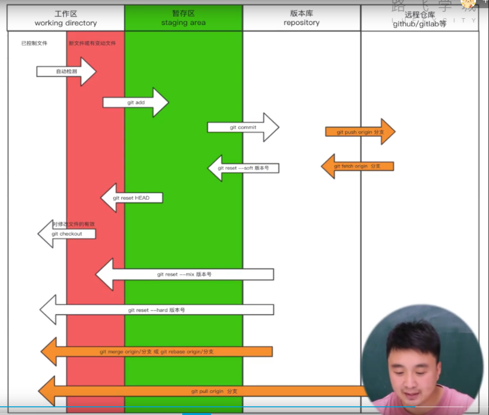

# <mark>Git：分布式版本控制软件</mark>

---

> 这意味着，本地也会有版本控制仓库（V1、V2、V3版本），本地修改后，一般先（把V4）提交到本地的版本控制仓库，再（把V4）推送到中心服务器仓库。

---

# 官网

[Git官网](https://git-scm.com/)

[Git for Windows](https://gitforwindows.org/)

# git的相关工作区域



- 工作区
  
  - 已入版本库
  
  - 新修改

- 暂存区

- 版本库

# FIRST COMMAND

```git
git --version
git --help
git help xxx
```

# 全局初始化

## 配置文件相关

- 项目配置文件
  
  - 文件位置：当前项目文件/.git/config
  
  - ```git
    --local
    ```

- 全局配置文件
  
  - 文件位置：~/.gitconfig
  - ```git
    --global
    ```

- 系统配置文件
  
  - 文件位置：/etc/.gitconfig
  
  - ```git
    --system
    ```

## 个人信息配置

```git
git config --global user.name "Hasee"
git config --global user.email "940@qq.com"
```

验证配置：

```git
git config --global --get-all user.name
git config --global --get-all user.email
git config --list
```

# 开始仓库

开始仓库有两种方法：

1. 创建新的仓库

2. 克隆仓库

下面介绍创建新的仓库，克隆仓库见[Github克隆仓库](#clone)。

## 仓库初始化

进入仓库目录

```git
git init
```

初始化后产生.git文件夹。

> .git文件夹：存放着Git管理信息的目录，初始化仓库时会自动创建。
> 如果想移除仅仅移除git而保留项目文件，则只需要删除.git文件夹即可。

> 另外，可用自行创建.gitignore文件，里面放着git忽略的文件（git不管理的文件），一个文件一行，可以用通配符。

# 日常使用

参考git相关工作区域部分。

## 检测文件的状态

```git
git status
```

- 如果没有修改或者已经commit了，则不显示

- 如果修改了还未add，则显示红色modified

- 如果修改了，add了，但是没有commit，则显示绿色modified

```git
git diff
```

只显示修改了还未add的具体修改情况。

## 查看版本信息

```git
git log
git log --graph --pretty=format:"%h %s"
git reflog    # 可以查看被reset的版本，即之后的版本
```

## 不同文件状态之间的反复横跳

### 恢复回原始文件

```git
git checkout -- xxx
```

修改了未add的，恢复成未修改的状态

### 添加到本地库暂存区

```git
git add xxx
git add .
```

### 本地库暂存区退回工作区修改状态

```git
get reset HEAD
```

### 提交到本地版本控制仓库（生成版本）

```git
git commit -m "注释xxx"
```

### 从版本控制仓库退回到暂存区

```git
git reset --soft 版本hash
```

### 从版本控制仓库退回到工作区修改状态

```git
git reset --mix 版本hash
```

### 版本回滚【完整回滚至工作区】

```git
git reset --hard 版本hash
```

## 分支相关

git的后一个版本只保存修改的位置，没修改的地方回通过一个指针指向前一个版本。

主分支一般默认是master。

### 查看分支

```git
git branch
```

其中带*的绿色的是当前分支。

### 创建分支

```git
git branch xxx
```

新创建的分支指向当前分支的当前版本。

### 删除分支

```git
git branch -d xxx
```

### 切换分支

```git
git checkout xxx
```

### 合并分支

```git
git merge xxx
```

将xxx分支的内容合并到当前分支上。

合并的时候可能出现冲突，解决方法是手动修复，然后重新提交（add、commit）。

解决冲突的高阶操作见[配合Beyond Compare解决冲突](#BCconflict)。

### 变基

作用是将多个提交记录合并成一个。

#### 申请合并

```git
git rebase -i 版本Hash
```

从该版本到现在的提交记录合并

```git
git rebase -i HEAD~3
```

最近三次提交合并

#### 修改合并后的记录情况

将

```textile
pick 123231
pick 123232
pick 123233
```

修改为：

```textile
pick 123231
s 123232
s 123233
```

pick是保留的版本，其他的改为s。

commit提交。

## 版本标签相关

可以认为是版本的别名，在Github上可以显示。

```git
git tag -a v1 -m "xxx"
```

在本次记录上打一个tag标签

推送到远程

```git
git push origin --tags
```

# Github配合

## 连接到Github上

### 本地创建密钥

```bash
ssh-keygen -t -rsa -C "940@qq.com"
```

在~\.ssh目录中（如C:\Users\zqg\.ssh），生成了id_rsa和id_rsa.pub文件。其中前者是私钥，后者是公钥。 

### 将密钥上传到Github上

在Github-头像-Settings-SSH and GPG keys-New SSH key，添加公钥的内容。

### 测试联通性

```bash
ssh -T git@github.com
```

## 与远程库关联

### 检查本地的库是否已经关联

```git
git remote -v
```

### 添加关联

```git
git remote add origin "http://github.com/zqg/test.git"
```

意思是添加了一个本地标识（别名）：origin，这个别名指向后面的URL。

### 删除关联

```git
git remote remove origin
```

## 推送

完整写法：

```git
git push origin main master
```

origin是关联的本地标识，main是本地分支，master是远程分支。

远程分支可以缺省，则与本地同名。

```git
git push -u origin main master
```

-u意思是设为默认，以后可以直接缺省推送：

```git
git push
```

## 拉取

### 克隆（首次拉取）<a name="clone"></a>

```git
git clone http://github.com/zqg/test.git ./
```

./可以缺省，则在当前目录下创建一个子文件夹，名字为远程库名。

此时，拉取的仓库只显示master分支，但是依然可以直接切换分支。（只是切换前不显示而已）

### 往本地仓库拉取合并

```git
git pull origin xxx
```

这个命令等同于：

```git
git fetch origin xxx
git merge origin origin/xxx
```

或者

```git
git fetch origin xxx
git rebase origin/xxx
```

其中，fetch是把远程仓库拉到本地版本库，merge是把本地版本库放回本地工作区。

## 协同工作

在Github-头像-Settings-Collaborators，邀请用户即可添加协同工作者。

# 高阶操作

## 配合Beyond Compare解决冲突 <a name="BCconflict"></a>

```git
git config --global merge.tool bc
git config --global mergetool.path 'D:\BeyondCompare\BCompare.exe'
git config --global mergetool.keepBackup false
```

使用方法：

```git
git mergetool
```